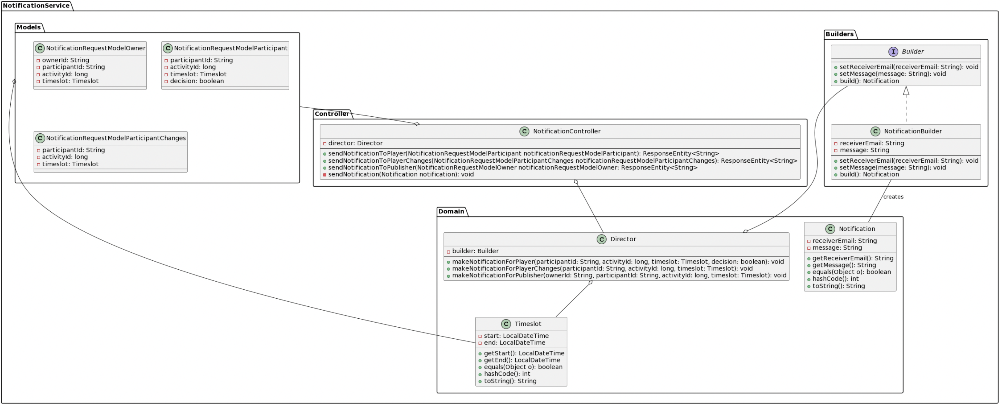

Builder DP for Notification Microservice
====
The ‘Notification’ microservice has an implementation which respects the ‘Builder’ design pattern, as this service mainly focuses on the construction of a complex object with many possible representations, the ‘Notification’, and on its propagation through email towards users.

Consider the construction of a notification. A notification is the final end product that is to be returned as the output of the construction process and sent towards a user. As of now, the building part has two steps: setting the receiver and constructing the message, methods defined in the ‘Builder’ interface and implemented in the ‘NotificationBuilder’. Using the same process, one can build notifications with different types of messages for the scenarios described in the „Architecture” section, paragraph „Notifications Microservice”.

In order to create and send a specific type of notification, there is a ‘Director’ who calls its ‘makeNotification’ method for that notification in particular, then calls the ‘build’ method on its own builder to generate the final product. Finally, the NotificationController sends the notification by calling its ‘sendNotification’ method. 

The greatest advantage of this desing pattern is that it makes the notification construction process independent of the parts that it consists of (receiver and message) and how they’re assembled: only their internal values count as differences. As a follow-up advantage, this pattern handles abstraction and complexity well, because the same construction process can be used for any representation of a notification.

Another idea of design pattern for this microservice would have been the ‘Abstract Factory’, since it handles families of complex objects properly and provides a fine, abstract, construction process. The reason we did not choose to implement it is the following: currently our application’s goal is to send notifications in a single ‘family’ format - email. If it was necessary to send notifications in another format as well, for example SMS, then the ‘Abstract Factory’ could show its main purpose; for now it is not the case.

UML
---

Chain of responsibility for Authentication Microservice
===

The authentication service is implemented using the chain of responsibility design pattern. In simple words, this pattern splits a large task into distinct subtasks which are assigned to individual components called handlers. These handlers are linked together in a chain where each one calls the next after it finishes its task.

Workings
---
The authentication microservice has two main tasks: allowing clients to authenticate themselves so they can use the other microservices and facilitating the registration of new users. To perform these tasks the microservice uses four handlers. These are constructed and called by the Controller class that handles the incoming requests.

When an authentication request comes in, the SanitizeCredentials handler is called and the client’s credentials are passed to it. This first handler sanitizes the credentials and confirms that the userId is an email-address. It also hashes the password. If no errors are reported, the first handler calls the next in the chain and again passes it the credentials. The second handler is called VerifyCredentials. It does what the name suggests and checks if the supplied credentials match the credentials in the database. When the credentials are verified, the last handler is called. The CreateToken handler takes the now verified credentials and creates a JSON Web Token (JWT). This token is what the client can use to easily authenticate themselves at the other microservices. The last handler doesn't call any other handler, but instead stores the created JWT as a class variable. When the chain is complete, the Controller can access the JWT from the CreateToken handler and send it to the client.

The procedure for the registration is very similar. The Controller once again constructs the chain of handlers. The only difference compared to authentication is in the second handler. Instead of verifying the credentials, a handler called CreateAccount is used. This handler checks if an account with the supplied userId doesn't already exist and adds a new account. The first and last handlers in this chain are the same as before: the credentials are sanitized and at the end a JWT is created. The Controller again completes the request by sending the client the created token.

Additionally, these two chains use an extra handler called the ExceptionHandler. This handler is different from the other ones, because it is only called when an exception or mistake occurs. The ExceptionHandler is set in all the handlers in the chain. When an exception occurs in a handler, it reports the exception to the ExceptionHanler and breaks the chain by stopping its execution. This procedure is used for genuine Java exceptions, but also for events that cause the chain's task to fail. For example, when the client supplied a username that is not an email-address when registering or an incorrect password when authenticating. In such cases, the handlers can also set a custom error message and HTTP status code (400 or 500) in the ExceptionHandler. When the execution of the chain has ended, the Controller first checks the ExceptionHandler to see if an exception has occurred. If this is the case, it gets the error message and status code from the handler and sends this information back to the client. Only when the ExceptionHandler hasn't detected an error, the Controller gets the JWT and completes the request with success.

Advantages
---
The implementation with the chain of responsibility pattern has some great advantages: an authentication process always involves different steps that can easily be split into handlers. This allows for clean code where each class has one clear goal. Furthermore, exceptions can be handled cleanly without disrupting the operation of the entire service. A large plus is that code can be easily reused. In the implementation, two of the handlers are used in both the registering and authenticating chains. But the biggest advantage is scalability. This pattern makes it incredibly easy to insert new handlers into the chain or to swap out existing ones. Our relatively simple authentication service could be easily upgraded by creating new handlers and adding them to the chains. It is also very easy to create new different chains using the existing handlers.

UML
---

