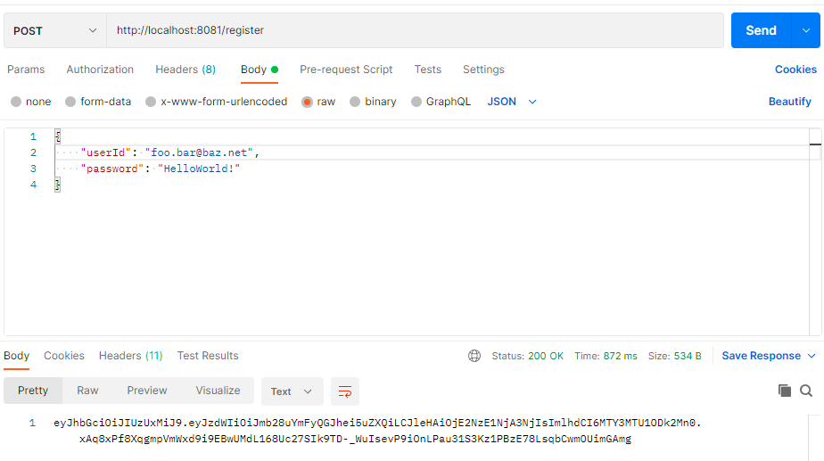
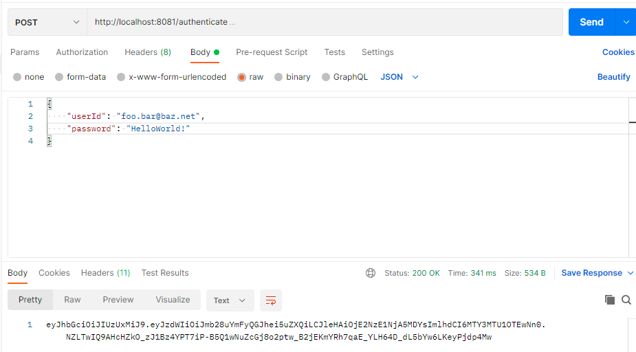
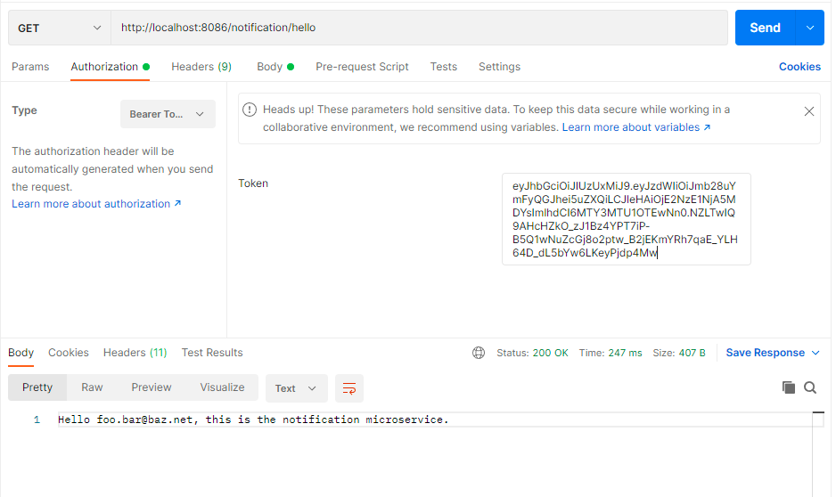

# Rowing scenario - Group 30b

This template contains five microservices:
- auth-microservice
- activities-microservice
- users-microservice
- notification-microservice
- matching-microservice

### *Authentication microservice (auth-microservice)*
In order to use the system, you must be authenticated. To do this, make a request to the authentication service on port 8081.
To  create an account, post an email-address as userId and a password to /register.

To sign in with an existing account, post your userId and password to /authenticate.

After each successful registration or authentication you will receive a token. Include this token in the authorization header in all your requests to other services in order to be automatically authenticated.

### *Notification microservice (notification-microservice)
In order to send notifications via email, one must be authenticated first. Otherwise an error will be shown, mentioning this has not been done properly. After following the steps mentioned in the Authentication section, include your bearer token in the "Authorization" page in Postman for each request you want to make.
