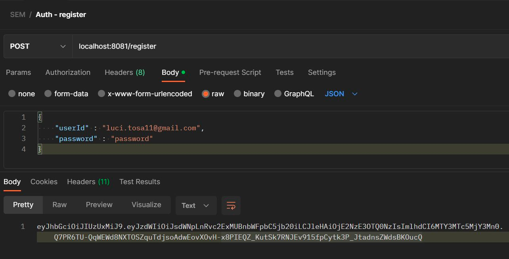

# Rowing scenario - Group 30b

This template contains five microservices:
- auth-microservice
- activities-microservice
- users-microservice
- notification-microservice
- matching-microservice

### *Authentication microservice (auth-microservice)*
In order to use the system, you must be authenticated. To do this, make a request to the authentication service on port 8081.
To  create an account, post an email-address as userId and a password to /register.

To sign in with an existing account, post your userId and password to /authenticate.

After each successful registration or authentication you will receive a token. Include this token in the authorization header in all your requests to other services in order to be automatically authenticated.

### *Notification microservice (notification-microservice)*
In order to send notifications via email, one must be authenticated first. Otherwise an error will be shown, mentioning this has not been done properly. After following the steps mentioned in the Authentication section, include your bearer token in the "Authorization" page in Postman for each request you want to make.

To email a rower regarding a decision about his participation in a training / competition, one should include the following details in the request body: the id of the participant, the id of the activity, the timeslot he applied for and the decision from the owner of the activity:

To email a rower regarding a modification or the deletion of an activity he has been matched with, the following request should be made mentioning the participant id, the activity id and the timeslot:

To email a publisher of an activity when a rower requested to participate in that activity at a certain timeslot, the following request should be made:

This is an example of email you can receive as a rower, when you get accepted for an activity:

### *Users microservice (users-microservice)*
In order to successfully communicate with the Users micro-service, the client must include the bearer token from the authentication micro-service in the Authorization section in Postman. Failing to do so will lead to a 401 error message:

The first step for a client to take is to create their account, specifying their email and additional information they want to include from gender, organisation, competitiveness and certificates. A valid email must always be included, if gender is specified it can be 'Male' or 'Female'. After running the system for the first time, the only valid organisations will be 'DelftRowing', 'Laga', 'Proteus' and 'OlympicRowers', whilst the only valid certificates will be 'C4', '4+', '8+'. Failing to meet these constraints will result in informative error messages. We verify that these constraints are met using a chain-of-responsibility design pattern validation sequence. Attempting to create an account for an email you are not authenticated for, or an account for an email that already has an account will also lead to informative error messages.

Once their account is made, clients can update their data (excluding email), the email must always be included in request. Clients can only update accounts they are authenticated for, after having first created the account. If any attributes are not specified in the update, the system will keep the previously stored values:

Once their account is made, the client can view their own data, through the bearer token, without having to specify their email.

There is also the possibility for authenticated clients to add a new organization to the system. This will result in an error message if attempting to add an organisation that is already recognized by the system.

### *Activity microservice (activities-microservice)*
The activities micro-service is responsilbe for storing data about all the activities, including the timeslot, the id of the owner, and etc. It can be accessed by client to add, edit, or delete activities, and is connected to the notifications micro-service. First of all, a user has to be authenticated before being able to interact with the server.
To create an Activity: fill in all the required fields, otherwise, the request will be discarded.

To update, you have to send the id of the activity as well as set all the fields that you would like to be updated. Some of them, such as ownerId cannot be updated.

To delete an activity, only it's id is needed as a path parameter.

### *Matching microservice (matching-microservice)*
Being responsible for matching the availabilities specified by users with already existing activities in the repository, the **'Matching’ microservice** is meant to emulate the interaction between the other Users and Activity services by ensuring that the process of matching a user to an activity can be successfully completed based on some constraints enforced by the 'Rowing' scenario.

Thus, there are several steps that the **'Matching’ microservice** is responsible for in order to ensure the main functionality of the 'Rowing' app. Note that all of the interaction between this mircoservice and the other microservices/client is possible only by using the token provided upon authentication (matter handled by the **'Authentication’ microservice**.

Consequently, the first step before starting to interact directly with the **'Matching’ microservice** is to set up an account for a new user (steps 1. and 2.)

1. **'Authentication’ microservice** (register + authenticate)
   
   

2. **'Users’ microservice** (set up details of new user)
   

Then, in order to be able to match a user to an activity we need to have activities published in the first place and for that we will make use of the corresponding subsystem.

3. **'Activity’ microservice** (publish a new activity - to be used for matching the user)

- Publish a Training

- Publish a Competition

After completing all this steps we repeat steps 1. and 2. with another email to create the user that will act as the participant to the activities created by the previously created user.

4. **'Matching’ microservice**

- The user submits the availability and the desired position and it gets back a list of possible activities that they are able to participate to given their profile, timeslot and position chosen (inside this request the filtering of activities is done based on the constraints given and ensured by the Chain of Responsibility pattern - note that all cases for filtering are tested by Unit testing inside the app)

- The user then picks an activity they want to participate to by doing a request with the id of the match (the status of the match is now changed to Pending)

- When doing this, by communicating with the **'Notification’ microservice**, the owner of the activity gets the following email

- Next, based on a "pull" manner, the owner can log in into the app and request all the participants that have been matched to their activity and also see the status they are in: PENDING, MATCHED, ACCEPTED, DECLINED
  

- Following this, the owner does a request to the service to decide whether they accept or decline the user by sending the id of the match and a boolean value (TRUE - accepted / FALSE - declined).

1. The user is accepted

Gets an email telling them they have been accepted

And a request is done internally to the **'Activities’ microservice** for decreasing by one the available places for the activity the user has been accepted to and the position they requested.

Now we can do a request to see all the matches that have status matched and we will get only one since the other match has now status accepted

2. User is declined

We first repeat the first steps by allowing the user to pick the other activity they have been matched to

Now, we can see that the status of the match is indeed pending

The owner does another request now declining the user

As seen above the user gets an email now saying that they have been declined

And the status of the match is updated accordingly to declined

5. **'Activity’ microservice** (delete/edit an activity)

When a user does a request for modifying/deleting an activity a request is done to the **'Matching’ microservice** for updating the info accordingly - all the matches to that certain activity are discarded (from the database) and the users accepted previously are announced of the modification (sending a request to the **'Notification’ microservice**).

Thus, no more matches are accepted since the activity of the accepted match was modified

And this is the email that the participant gets

6. **'Matching’ microservice**

This microservice is also responsible for the automatic addition of the certificates provided in the 'Rowing' scenario but it also has an additional feature of being able to add new certificates that supersede previously added ones. We also included a validation endpoint that verifies if the introduced certificate is among the possible ones used for the current application. (this is also called by other microservices for checking if the certificate provided by the client in the request is an eligible one).

Thus, when running the app certificates "C4" "4+" and "8+" are automatically added in this order. As a consequence, if we try to validate "SEM" we get false, but if we try "C4" we get true

Next we can add the certificate to the system by using the addition API endpoint

To wrap up, the **'Matching’ microservice** is carefully implemented to take into consideration various special cases and ensure the basic, main functionality of the application whilst also bringing some great addition to the simple required flow of the app.

